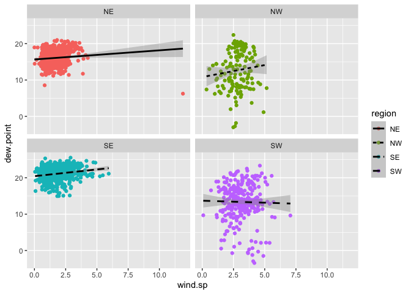
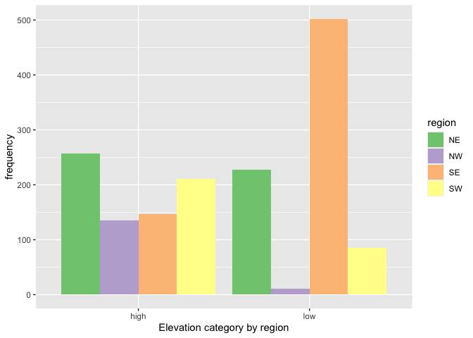
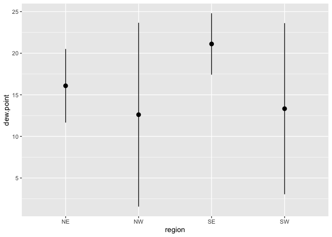
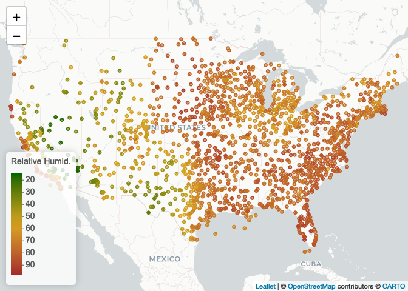

Lab04
================
VY
2022-09-14

Download file if needed and remove any temp less than -17 and look for
key missing data. No 9999 in dew point or wind speed.

``` r
webshot::install_phantomjs()
```

    ## It seems that the version of `phantomjs` installed is greater than or equal to the requested version.To install the requested version or downgrade to another version, use `force = TRUE`.

``` r
library(leaflet)

library(webshot)

if (!file.exists("met_all.gz"))
  download.file(
    url = "https://raw.githubusercontent.com/USCbiostats/data-science-data/master/02_met/met_all.gz",
    destfile = "met_all.gz",
    method   = "libcurl",
    timeout  = 60
    )
met <- data.table::fread("../Lab04/met_all.gz")

met <- met[temp>-17][elev == 9999.0, elev := NA]

str(met)
```

    ## Classes 'data.table' and 'data.frame':   2317204 obs. of  30 variables:
    ##  $ USAFID           : int  690150 690150 690150 690150 690150 690150 690150 690150 690150 690150 ...
    ##  $ WBAN             : int  93121 93121 93121 93121 93121 93121 93121 93121 93121 93121 ...
    ##  $ year             : int  2019 2019 2019 2019 2019 2019 2019 2019 2019 2019 ...
    ##  $ month            : int  8 8 8 8 8 8 8 8 8 8 ...
    ##  $ day              : int  1 1 1 1 1 1 1 1 1 1 ...
    ##  $ hour             : int  0 1 2 3 4 5 6 7 8 9 ...
    ##  $ min              : int  56 56 56 56 56 56 56 56 56 56 ...
    ##  $ lat              : num  34.3 34.3 34.3 34.3 34.3 34.3 34.3 34.3 34.3 34.3 ...
    ##  $ lon              : num  -116 -116 -116 -116 -116 ...
    ##  $ elev             : int  696 696 696 696 696 696 696 696 696 696 ...
    ##  $ wind.dir         : int  220 230 230 210 120 NA 320 10 320 350 ...
    ##  $ wind.dir.qc      : chr  "5" "5" "5" "5" ...
    ##  $ wind.type.code   : chr  "N" "N" "N" "N" ...
    ##  $ wind.sp          : num  5.7 8.2 6.7 5.1 2.1 0 1.5 2.1 2.6 1.5 ...
    ##  $ wind.sp.qc       : chr  "5" "5" "5" "5" ...
    ##  $ ceiling.ht       : int  22000 22000 22000 22000 22000 22000 22000 22000 22000 22000 ...
    ##  $ ceiling.ht.qc    : int  5 5 5 5 5 5 5 5 5 5 ...
    ##  $ ceiling.ht.method: chr  "9" "9" "9" "9" ...
    ##  $ sky.cond         : chr  "N" "N" "N" "N" ...
    ##  $ vis.dist         : int  16093 16093 16093 16093 16093 16093 16093 16093 16093 16093 ...
    ##  $ vis.dist.qc      : chr  "5" "5" "5" "5" ...
    ##  $ vis.var          : chr  "N" "N" "N" "N" ...
    ##  $ vis.var.qc       : chr  "5" "5" "5" "5" ...
    ##  $ temp             : num  37.2 35.6 34.4 33.3 32.8 31.1 29.4 28.9 27.2 26.7 ...
    ##  $ temp.qc          : chr  "5" "5" "5" "5" ...
    ##  $ dew.point        : num  10.6 10.6 7.2 5 5 5.6 6.1 6.7 7.8 7.8 ...
    ##  $ dew.point.qc     : chr  "5" "5" "5" "5" ...
    ##  $ atm.press        : num  1010 1010 1011 1012 1013 ...
    ##  $ atm.press.qc     : int  5 5 5 5 5 5 5 5 5 5 ...
    ##  $ rh               : num  19.9 21.8 18.5 16.9 17.4 ...
    ##  - attr(*, ".internal.selfref")=<externalptr> 
    ##  - attr(*, "index")= int(0)

``` r
summary(met$elev)
```

    ##    Min. 1st Qu.  Median    Mean 3rd Qu.    Max.    NA's 
    ##   -13.0   101.0   252.0   414.3   400.0  4113.0     182

``` r
summary(met$temp)
```

    ##    Min. 1st Qu.  Median    Mean 3rd Qu.    Max. 
    ##   -3.00   19.60   23.50   23.59   27.80   56.00

``` r
summary(met$dew.point)
```

    ##    Min. 1st Qu.  Median    Mean 3rd Qu.    Max.    NA's 
    ##  -37.20   13.80   18.10   17.02   21.70   36.00    6287

``` r
summary(met$wind.sp)
```

    ##    Min. 1st Qu.  Median    Mean 3rd Qu.    Max.    NA's 
    ##    0.00    0.00    2.10    2.46    3.60   36.00   31743

``` r
library(tidyverse)
```

    ## ── Attaching packages
    ## ───────────────────────────────────────
    ## tidyverse 1.3.2 ──

    ## ✔ ggplot2 3.3.6     ✔ purrr   0.3.4
    ## ✔ tibble  3.1.8     ✔ dplyr   1.0.9
    ## ✔ tidyr   1.2.0     ✔ stringr 1.4.1
    ## ✔ readr   2.1.2     ✔ forcats 0.5.2
    ## ── Conflicts ────────────────────────────────────────── tidyverse_conflicts() ──
    ## ✖ dplyr::filter() masks stats::filter()
    ## ✖ dplyr::lag()    masks stats::lag()

``` r
library(data.table)
```

    ## 
    ## Attaching package: 'data.table'
    ## 
    ## The following objects are masked from 'package:dplyr':
    ## 
    ##     between, first, last
    ## 
    ## The following object is masked from 'package:purrr':
    ## 
    ##     transpose

New date column, keep only first week data

``` r
met <- met[ , ymd := as.Date(paste(year, month, day, sep= "-"))]
table(met$ymd)
```

    ## 
    ## 2019-08-01 2019-08-02 2019-08-03 2019-08-04 2019-08-05 2019-08-06 2019-08-07 
    ##      73681      74036      74983      74559      74285      74610      75586 
    ## 2019-08-08 2019-08-09 2019-08-10 2019-08-11 2019-08-12 2019-08-13 2019-08-14 
    ##      75679      73452      73660      74328      73125      74936      75855 
    ## 2019-08-15 2019-08-16 2019-08-17 2019-08-18 2019-08-19 2019-08-20 2019-08-21 
    ##      74207      76220      76363      77216      74774      73506      73686 
    ## 2019-08-22 2019-08-23 2019-08-24 2019-08-25 2019-08-26 2019-08-27 2019-08-28 
    ##      76344      75547      75035      74955      77239      77870      75217 
    ## 2019-08-29 2019-08-30 2019-08-31 
    ##      69931      73220      73099

``` r
met[, table(week(ymd))]
```

    ## 
    ##     31     32     33     34     35 
    ## 297259 521600 527922 523847 446576

``` r
met <- met[week(ymd)==31]
nrow(met)
```

    ## [1] 297259

Compute the mean by station of the variables temp, rh, wind.sp,
vis.dist, dew.point, lat, lon, and elev. (no 9999s)

``` r
met[, .(
  temp = max(temp),
  rh = max(rh, na.rm=T),
  wind.sp = max(wind.sp, na.rm=T),
  vis.dist = max(vis.dist, na.rm=T),
  dew.point = max(dew.point, na.rm=T),
  lat = max(lat),
  lon = max(lon),
  elev = max(elev, na.rm=T)
)]
```

    ##    temp  rh wind.sp vis.dist dew.point    lat     lon elev
    ## 1:   47 100    20.6   144841        29 48.941 -68.313 4113

``` r
met_avg <- met[, .(
  temp = mean(temp),
  rh = mean(rh, na.rm=T),
  wind.sp = mean(wind.sp, na.rm=T),
  vis.dist = mean(vis.dist, na.rm=T),
  dew.point = mean(dew.point, na.rm=T),
  lat = mean(lat),
  lon = mean(lon),
  elev = mean(elev, na.rm=T)
), by = "USAFID"]
head(met_avg)
```

    ##    USAFID     temp       rh  wind.sp vis.dist dew.point      lat       lon
    ## 1: 690150 33.79167 14.93604 3.932292 16042.72  2.641667 34.29992 -116.1659
    ## 2: 720110 30.95139 51.18987 1.785069 15936.55 18.763889 30.78400  -98.6620
    ## 3: 720113 23.65403 57.09799 1.476344 16080.02 13.861828 42.54300  -83.1780
    ## 4: 720120 25.59172 88.10970 1.580473 15402.63 23.378698 32.21746  -80.6998
    ## 5: 720137 22.39965 65.79964 0.937500 16059.47 14.828125 41.42500  -88.4190
    ## 6: 720151 28.62743 33.79417 3.075694 16048.30  9.980903 30.38300 -103.6830
    ##         elev
    ## 1:  694.5208
    ## 2:  336.0000
    ## 3:  222.0000
    ## 4:    6.0000
    ## 5:  178.0000
    ## 6: 1315.0000

Create a region variable for NW, SW, NE, SE based on lon = -98.00 and
lat = 39.71 degrees

``` r
met_avg <- met_avg[, region := fifelse(lon > -98 & lat > 39.71, "NE", 
                        fifelse(lon < -98 & lat > 39.71, "NW",
                                fifelse(lon < -98 & lat <= 39.71, "SW", "SE")))]
table(met_avg$region)
```

    ## 
    ##  NE  NW  SE  SW 
    ## 484 146 649 296

Create a categorical variable for elevation as in the lecture slides

``` r
met_avg[, elev_cat := fifelse(elev > 252, "high", "low")]
table(met_avg$elev_cat)
```

    ## 
    ## high  low 
    ##  750  825

Make violin plot (wind speed)

``` r
met_avg[!is.na(region) & !is.na(wind.sp)] %>%
   ggplot()+
  geom_violin(mapping=aes(x=1, y=wind.sp, color=region, fill = region)) +
  facet_wrap(~ region, nrow = 1)
```

<!-- --> NE
had one very windy day

``` r
met_avg[!is.na(region) & !is.na(dew.point)] %>%
   ggplot()+
  geom_violin(mapping=aes(x=1, y=dew.point, color=region, fill = region)) +
  facet_wrap(~ region, nrow = 1)
```

<!-- --> NW
and SW had highest range in dew points

Association between dew point and wind speed

``` r
met_avg[!is.na(region) & !is.na(wind.sp) & !is.na(dew.point)] %>%
   ggplot(mapping=aes(x = wind.sp, y = dew.point)) +
  geom_point(mapping = aes(color=region)) +
  geom_smooth(method = lm, mapping = aes(linetype = region), color = "black") +
  facet_wrap(~ region, nrow=2)
```

    ## `geom_smooth()` using formula 'y ~ x'

<!-- --> SW tends to have
negative linear relationship, all other regions have positive linear
relationship

geom_bar to create barplots of the weather stations by elevation
category coloured by region

``` r
met_avg[!is.na(elev_cat)] %>%
  ggplot() + 
  geom_bar(mapping = aes(x = elev_cat, fill = region), position = "dodge") + scale_fill_brewer(palette = "Accent") +
  labs(x = "Elevation category by region", y = "frequency")
```

<!-- -->

Use stat_summary to examine mean dew point and wind speed by region with
SD and error bars

``` r
met_avg[!is.na(dew.point)] %>%
  ggplot(mapping=aes(x = region, y = dew.point)) + 
    stat_summary(fun.data = mean_sdl)
```

<!-- -->

Spatial trend in releative humidity in US

``` r
top10rh <- met_avg[order(-rh)][1:10]

rh.pal <- colorNumeric(c('darkgreen','goldenrod','brown'), domain=met_avg$rh)
rh.pal
```

    ## function (x) 
    ## {
    ##     if (length(x) == 0 || all(is.na(x))) {
    ##         return(pf(x))
    ##     }
    ##     if (is.null(rng)) 
    ##         rng <- range(x, na.rm = TRUE)
    ##     rescaled <- scales::rescale(x, from = rng)
    ##     if (any(rescaled < 0 | rescaled > 1, na.rm = TRUE)) 
    ##         warning("Some values were outside the color scale and will be treated as NA")
    ##     if (reverse) {
    ##         rescaled <- 1 - rescaled
    ##     }
    ##     pf(rescaled)
    ## }
    ## <bytecode: 0x7fa9f24acc68>
    ## <environment: 0x7fa9f24ae280>
    ## attr(,"colorType")
    ## [1] "numeric"
    ## attr(,"colorArgs")
    ## attr(,"colorArgs")$na.color
    ## [1] "#808080"

``` r
rhmap <- leaflet(met_avg) %>% 
  # The looks of the Map
  addProviderTiles('CartoDB.Positron') %>% 
  # Some circles
  addCircles(
    lat = ~lat, lng=~lon,
                                                  # HERE IS OUR PAL!
    label = ~paste0(rh), color = ~ rh.pal(rh),
    opacity = 1, fillOpacity = 1, radius = 500
    ) %>%
  # And a pretty legend
  addLegend('bottomleft', pal=rh.pal, values=met_avg$rh,
          title='Relative Humid.', opacity=1)
rhmap
```

<!-- -->
