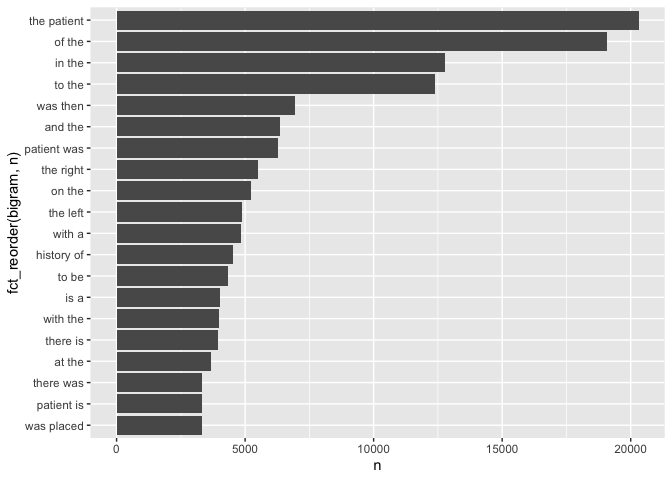
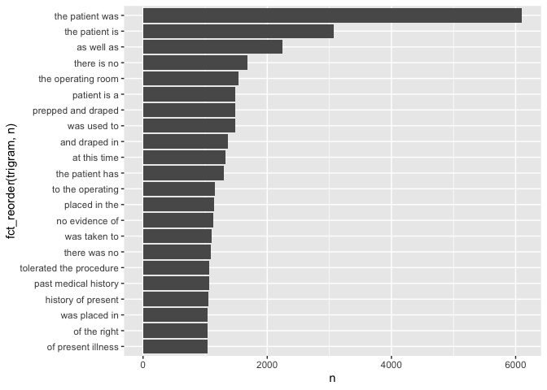

Lab05
================
VY
2022-09-28

``` r
library(dplyr)
library(data.table)
library(ggplot2)
library(tidytext)
library(tidyverse)
library(dtplyr)
library(knitr)
library(forcats)
library(utils)
```

## Read in data

``` r
if (!file.exists("mtsamples.csv"))
  download.file(
    url = "https://raw.githubusercontent.com/USCbiostats/data-science-data/master/00_mtsamples/mtsamples.csv",
    destfile = "mtsamples.csv",
    method   = "libcurl",
    timeout  = 60
    )
mtsamples <- read.csv("mtsamples.csv")
mts <- as_tibble(mtsamples)
```

## What specialties do we have? What are the frequencies of each?

``` r
library(dplyr)
specialties <- count(mts, medical_specialty)

specialties %>%
    arrange(desc(n)) %>% 
      knitr::kable()
```

| medical_specialty             |    n |
|:------------------------------|-----:|
| Surgery                       | 1103 |
| Consult - History and Phy.    |  516 |
| Cardiovascular / Pulmonary    |  372 |
| Orthopedic                    |  355 |
| Radiology                     |  273 |
| General Medicine              |  259 |
| Gastroenterology              |  230 |
| Neurology                     |  223 |
| SOAP / Chart / Progress Notes |  166 |
| Obstetrics / Gynecology       |  160 |
| Urology                       |  158 |
| Discharge Summary             |  108 |
| ENT - Otolaryngology          |   98 |
| Neurosurgery                  |   94 |
| Hematology - Oncology         |   90 |
| Ophthalmology                 |   83 |
| Nephrology                    |   81 |
| Emergency Room Reports        |   75 |
| Pediatrics - Neonatal         |   70 |
| Pain Management               |   62 |
| Psychiatry / Psychology       |   53 |
| Office Notes                  |   51 |
| Podiatry                      |   47 |
| Dermatology                   |   29 |
| Cosmetic / Plastic Surgery    |   27 |
| Dentistry                     |   27 |
| Letters                       |   23 |
| Physical Medicine - Rehab     |   21 |
| Sleep Medicine                |   20 |
| Endocrinology                 |   19 |
| Bariatrics                    |   18 |
| IME-QME-Work Comp etc.        |   16 |
| Chiropractic                  |   14 |
| Diets and Nutritions          |   10 |
| Rheumatology                  |   10 |
| Speech - Language             |    9 |
| Autopsy                       |    8 |
| Lab Medicine - Pathology      |    8 |
| Allergy / Immunology          |    7 |
| Hospice - Palliative Care     |    6 |

There are 40 medical specialties. The frequency is not evenly
distributed. Surgery is most common with 1103 entries, Hospice -
Palliative Care is the least frequent with 6 entries. Some are related -
ie Consult - History and Physical and Discharge Summary are not
specialty-specific.

``` r
library(ggplot2)
library(forcats)
specialties %>% 
  top_n(10) %>%
  ggplot(aes(x=n, y= fct_reorder(medical_specialty, n))) +
  geom_col()
```

    ## Selecting by n

<!-- --> \##
Tokenize words in transcription and look at top 20

``` r
mts %>%
  unnest_tokens(word, transcription) %>%
  count(word, sort=TRUE) %>%
  top_n(20, n) %>%
  ggplot(aes(x=n, y=fct_reorder(word, n))) +
  geom_col()
```

<!-- --> There are a lot of
stop words here. The top word is “the” while we do see “patient”. We
should get rid of the stop words.

## Remove stop words

``` r
mts %>%
  unnest_tokens(word, transcription) %>%
  count(word, sort=TRUE) %>%
  anti_join(stop_words, by = c("word")) %>%
  filter(!grepl(pattern = "^[0-9]+$", x=word)) %>%
  top_n(20, n) %>%
  ggplot(aes(x=n, y=fct_reorder(word, n))) +
  geom_col()
```

<!-- --> These look
more likel medical terms. Numbers were removed from the list of words.

## Repeat question 2, but this time tokenize into bi-grams. how does the result change if you look at tri-grams?

``` r
mts %>%
  unnest_ngrams(bigram, transcription, n=2) %>%
  count(bigram, sort=TRUE) %>%
  top_n(20, n) %>%
  ggplot(aes(x=n, y=fct_reorder(bigram, n))) +
  geom_col()
```

<!-- --> “The patient” was the
top bigram. There are a lot of non-interesting bigrams (of the, in the).

``` r
mts %>%
  unnest_ngrams(trigram, transcription, n=3) %>%
  count(trigram, sort=TRUE) %>%
  top_n(20, n) %>%
  ggplot(aes(x=n, y=fct_reorder(trigram, n))) +
  geom_col()
```

<!-- --> Top 20 trigrams seem
more medical.

## Using the results you got from questions 4. Pick a word and count the words that appears after and before it.

``` r
ptbigram <- 
  mts %>%
  unnest_ngrams(bigram, transcription, n=2) %>%
  separate(bigram, into = c("word1", "word2"), sep = " ") %>%
  select(word1, word2) %>%
  filter(word1 == "patient" | word2 == "patient")
```

Words appearing before patient

``` r
ptbigram %>%
  filter(word2 == "patient") %>%
  count(word1, sort=TRUE) %>%
  anti_join(stop_words, by = c("word1" = "word")) %>%
  top_n(10, n) %>%
  ggplot(aes(x=n, y=fct_reorder(word1, n))) +
  geom_col()
```

<!-- -->
Words appearing after patient

``` r
ptbigram %>%
  filter(word1 == "patient") %>%
  count(word2, sort=TRUE) %>%
  anti_join(stop_words, by = c("word2" = "word")) %>%
  top_n(10, n) %>%
  ggplot(aes(x=n, y=fct_reorder(word2, n))) +
  geom_col()
```

<!-- -->
Looks reasonable!

## Which words are most used in each of the specialties. you can use group_by() and top_n() from dplyr to have the calculations be done within each specialty. Remember to remove stopwords. How about the most 5 used words?
